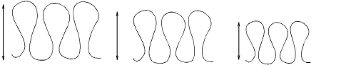
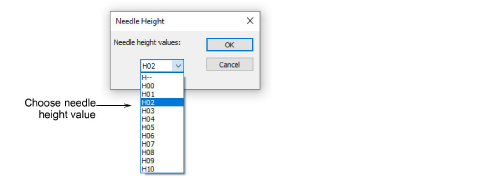
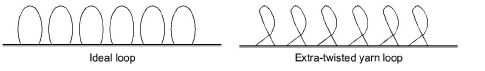

# Needle height

Needle height controls the height of the loop formed by the chenille machine when it is sewing a moss stitch. The needle height setting has less effect on chain stitches though it does affect width.

## With moss stitching

You may use different needle heights for different areas of color. Or between fills and borders – lower for borders, higher for fills. When using Compound Chenille, you can change needle heights of each offset.

The chenille machine pulls up the same length of yarn for each loop according to the current needle height setting. Even though stitch length affects loop height, it is easier and more accurate to adjust needle height. If you intend to use loops of various height, adjust the needle height rather than stitch length.

## With chain stitching

Needle height has a thread tensioning effect on chain. For chain, the greater the needle height, the tighter the thread tension. With tighter thread tension, chain looks narrower.

## Needle height control

With some chenille machines, needle height can be specified in the design. While stitching out, the chenille machine will automatically change needle height according to your selection. Normally, it’s best to use default settings. Do a test run on the machine to check the outcome. Then, if necessary, adjust needle heights.

The Melco tape file format has specific codes assigned to each needle height position. It uses 26 different needle height positions, which are designated ‘A’ through ‘Z’. Height ‘A’ is the lowest - 0.0100’, ‘Z’ is the highest - 0.3225’. Each successive letter is 0.0125’ higher than the preceding letter. The actual needle height measurement is a distance from upper surface of the needle plate to the inside of the needle hook.

The Melco system is an industry standard which is also used by other machine formats. Some brands use proprietary needle height parameters. Barudan machines, for instance, use numbering rather than letters. [See also Controlling needle heights.](../chenille_digitizing/Controlling_needle_heights)

With some machines, needle height can also be adjusted on the machine. In practice, it is more common to adjust there rather than in the design. Thus you can choose whether to use heights specified in the design or not. [See also Needle height default.](../chenille_output/Needle_height_default)

Dahao controllers, on the other hand, do not support needle height values in the machine file. This is set manually on the machine control panel according to the heights specified in the Production Worksheet.

## Coil direction

For some machines, best results with Coil are achieved by sewing in a counterclockwise direction because when you sew in a clockwise direction, you are adding more twist to the yarn causing it to become tighter, distorting the moss stitch loops. Refer to your machine handbook for details.

