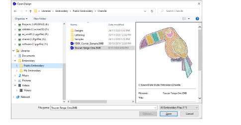
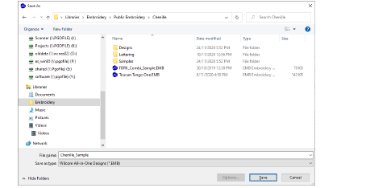

# Open & save chenille designs

|  | Use Standard > Save Design to save the current design. Right-click to open the Save As dialog. |
| ---------------------------------------- | ---------------------------------------------------------------------------------------------- |

As with lockstitch designs, all information about a chenille design is stored in the native EMB file format, regardless of machine format. This makes it easy to write designs to different formats. Chenille files open in EmbroideryStudio like any other EMB design. Similarly, you save chenille designs to native EMB like any other embroidery file.

## To open or save a chenille design...

- Click the Open icon or select File > Open. Open your EMB chenille design file like any other native design file.

- Click the Save Design icon. If this is the first time you have saved the design, the Save As dialog opens. Alternatively, choose File > Save As. File type will default to the latest EMB, but you can save to previous versions via the Save as type droplist.

## Related topics

- [Outputting chenille designs](../chenille_output/Outputting_chenille_designs)
