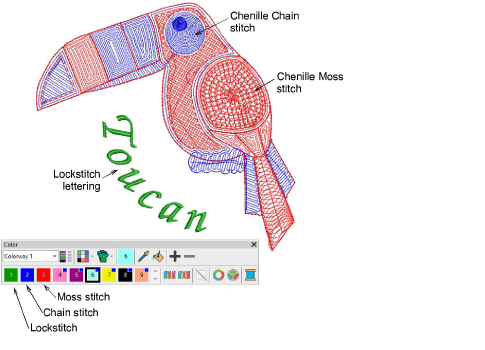
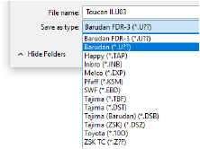

# Standard machine formats

Different embroidery machines speak different languages. They have their own control commands for various machine functions. If a design was created as a chenille design, you need to select the associated machine format when opening the file in order to display the chenille functions correctly. Similarly, before you can stitch a design, it must be in a format which can be understood by the machine. Chenille stitch types – Moss and Chain – can only be used with a chenille machine format.

EmbroideryStudio supports Tajima – both the old TMCE-100 and new TMCE-600 models – Barudan and Melco chenille machines. Chinese machines are capable of chenille with Dahao and other brands of control panel. Support is provided for these machine types:

| Machine format                                                                                    |     | File format |
| ------------------------------------------------------------------------------------------------- | --- | ----------- |
| Tajima TBF                                                                                        |     | TBF         |
| Tajima TMCE-100                                                                                   |     | DST         |
| Tajima TMCE-600                                                                                   |     | DST         |
| Barudan FDR-II Chenille Combination                                                               |     | U??         |
| Barudan Chenille                                                                                  |     | U??         |
| Barudan FDR-II Twin Sequin Chenille Combination                                                   |     | U??         |
| Barudan FDR-3                                                                                     | ^   | U??         |
| Barudan FDR-3 Chenille Combination  |     | (FDR-3) U?? |
| Dahao                                                                                             | \*  | DST         |
| Melco Chenille                                                                                    |     | EXP         |
| ZSK                                                                                               |     | Z??         |

## Tips for use

- ^ When exported, the file extension appears as ‘U01’ or ‘U02’, etc. The difference between the two formats is that FDR-3 U?? is compatible with newer machine function codes.
- \* EmbroideryStudio does not support Dahao DHB machine file format. Only WilcomDahao ES can export to this format. However, the Dahao control panel can receive DST files. With DST, the machine operator must manually assign the Chenille yarn sequence as well as the lockstitch needlebar sequence.

## Related topics

- [Chenille machine formats](../chenille_output/Chenille_machine_formats)
- [Machine format settings](../chenille_output/Machine_format_settings)
- [Chenille machine files](../chenille_output/Chenille_machine_files)
- [Outputting chenille designs](../chenille_output/Outputting_chenille_designs)
