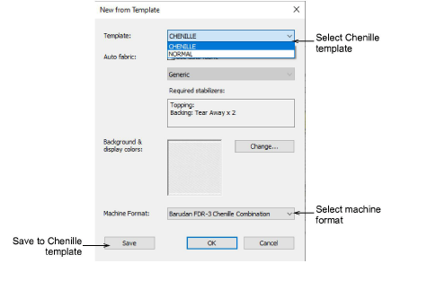

# Start a new chenille design

|  | Use File > New Design to start a new design with the chenille template. |
| -------------------------- | ----------------------------------------------------------------------- |

When you start EmbroideryStudio, a new file – Design1 – is automatically created ready for you to start digitizing. By default, Design1 is based on the NORMAL template. Use the CHENILLE template to create new chenille designs.

## To start a new chenille design...

- Start EmbroideryStudio and select CHENILLE as your template.

- Alternatively, with the design workspace already open, hold down Shift and click New Design. Or select File > New From Template to access the dialog.

The CHENILLE template defaults the system to chenille values. The machine format will switch to the default chenille machine.

::: info Note
Auto fabric is not applicable to chenille embroidery. Presets for pull compensation, underlay, backing, density, etc, have no relevance to chenille work.
:::

- Select your preferred machine format from the droplist if different to the default.

Finished designs can be sent direct to most chenille machines, or saved to your preferred chenille machine file format.

- If you choose a different machine, you can save it to the CHENILLE template via this dialog.

::: tip
You can change machine format at any time on a design-by-design basis via the Design menu.
:::

## Related topics

- [Switch machine formats](../chenille_output/Switch_machine_formats)
- [Custom machine formats](../../Setup/machines/Custom_machine_formats)
