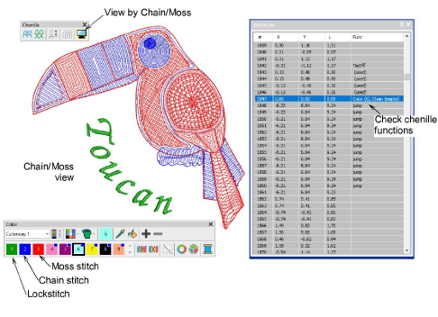

# Visualizing chenille stitching

|  | Use Chenille > View by Chain/Moss to view chenille objects in special mode to allow easy identification of chain and Moss elements – lockstitch in green, chain in blue, moss in red. |
| -------------------------------------------------- | ------------------------------------------------------------------------------------------------------------------------------------------------------------------------------------- |

The two basic stitch types created by all chenille embroidery machines are ‘moss’ and ‘chain’. In EmbroideryStudio, Moss and Chain are treated as machine functions which can be interpreted only by dedicated chenille or combination machines. Chenille objects cannot be viewed in TrueView but they can be viewed in a special viewing mode which allows easy identification of chain and moss elements.

## To visualize chenille stitching...

- Click the icon to activate Chain/Moss display or select View > View by Machine Function > Chain/Moss.

- The design appears using only the first three colors in the color palette. These color slots are best left for display purposes only, where:

| Slot | Default | Element    |
| ---- | ------- | ---------- |
| 1    | Green   | Lockstitch |
| 2    | Blue    | Chain      |
| 3    | Red     | Moss       |

- Use the Stitch List to check machine functions in the design.
- To travel by machine function, click/right-click the Travel by Function tool. Alternatively, press Ctrl + Page Up or Ctrl + Page Down. The needle point will stop at every [jump](../../glossary/glossary#jump), trim, and color change in the design.

::: info Note
TrueView does not display chain and moss stitching. However, it can still be useful to give an impression of the design when viewed at a small zoom factor (less than 1:1).
:::

## Tips for use

When examining your design prior to stitchout, note the following…

- Chenille design always starts with a Chain code.
- A Moss code must be present at the start of any Moss section.
- The Moss section must conclude with a Chain code.
- When continuing after a color change or trim, no additional function code is required. The new block will follow on with the same Chain code as the previous block.
- To conclude the Chenille section of design, a 'Chenille Off' code must be present. In TBF format, this is equivalent to a 'Lockstitch' code.
- After a 'Chenille Off' or 'Lockstitch' code is encountered, machine heads switch from Chenille to Lockstitch.
