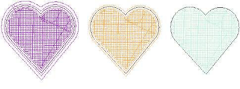
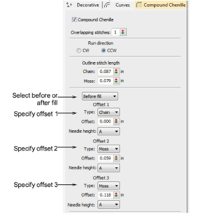
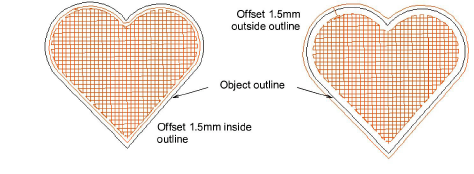

# Border settings

Chenille has no bobbin thread. Without tie-ins and tie-offs, Moss stitching can loosen during washing. It is common for a chenille object to employ moss fill with a chain border, before and after. Normally you first run a chain border as a tie-in. After the fill, a chain border is again applied as a tie-off.

As mentioned, Compound Chenille allows for up to three (1-3) offset borders, before and after. The number you add depends on size of object – the bigger the object, the more borders can be added. You have independent control over offset distance, stitch type – chain or moss – as well as needle height. As well as holding chenille objects in place, borders provide edge definition and embellishment. Variable heights can also be used to create gradations from center fill to outside edge.

## To set border properties...

- Select a Compound Chenille object and right-click the icon. The Object Properties > Compound Chenille docker opens.

- Set the ‘before fill’ offsets as required:
- Set a stitch type for each: Chain’, ‘Moss’, or ‘None’ (no offset). The first, and possibly only border, is usually stitched with Chain to act as a tie-in.
- Add borders as preferred: depending on object size, you may add more borders for edge definition and embellishment – the bigger the object, the more borders can be added.
- Set offset distance: use a positive value to position the border within the boundary, a negative value to offset it outside the boundary.
- From the droplist, set a needle height for each offset. This determines the height of loop formed when sewing moss stitch. It also affects the width of chain stitches.

- Repeat the operation for ‘after fill’ borders as required. Again:
- Set border stitch type: the first, and possibly only border, is usually stitched with Chain. This helps ‘tie-off’ the chenille object.

Tip: In practice, multiple borders tend to be stitched before rather than after the fill. From a stitch quality point of view, borders ‘after fill’ should be reserved for tie-off stitching. In the final stitch-out, you will see the number of borders but you won’t be able to tell which were stitched ‘before’ or ‘after’ the fill.

## Related topics

- [Create compound chenille objects](Create_compound_chenille_objects)
- [Chenille design parameters](../chenille_basics/Chenille_design_parameters)
- [Controlling needle heights](Controlling_needle_heights)
