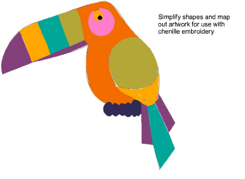

# Chenille Digitizing

Chenille design used to be a specialist technique. In reality, digitizing for chenille is easier than regular embroidery. In general, shapes are filled more simply and registration tolerances are broader.

It is important to map out a design, as you would regular embroidery, so as to minimize jumps. Even more than with regular embroidery, chenille designs need to employ simple, clear shapes which can be easily converted to chenille ‘stitch blocks’.

Concepts to keep in mind:

- Chenille work involves only two stitch types – Chain and Moss.
- Chenille usually involves a combination of two basic fill patterns – Square and Coil, single or double.
- For chenille, you mainly use Compound Chenille in combination with Complex Fill to digitize objects – even narrow ones – with built-in chain or moss borders.

## Related video

<iframe width="560" height="315" src="https://www.youtube.com/embed/VoPmf_xPMPo" title="YouTube video player" frameborder="0" allow="accelerometer; autoplay; clipboard-write; encrypted-media; gyroscope; picture-in-picture" allowfullscreen></iframe>

## Related topics

- [Creating compound chenille](Creating_compound_chenille)
- [Creating chain-stitch fills](Creating_chain-stitch_fills)
- [Creating narrow chenille shapes](Creating_narrow_chenille_shapes)
- [Creating chenille borders](Creating_chenille_borders)
- [Compound chenille settings](Compound_chenille_settings)
- [Controlling needle heights](Controlling_needle_heights)
