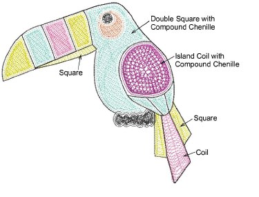
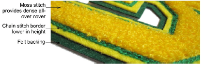

# Chenille fill pattern usage

Chenille work usually involves a combination of four fill patterns – Coil, Square, Double Square and Island Coil. The pattern you use depends on input method as well as object shape, size and the effect you want to achieve.

## Pattern types

Coil and Island Coil are traditional forms of chenille fill. They are both stitched in spirals, typically of moss stitching. This fill type mimics hand-made chenille embroidery. Coil may be used to fill columns or narrow areas. Larger areas may be filled with Island Coil.

Alternatively, use Double Square to generate stitches on a grid rather than coils. Similarly, Square can be used for narrow shapes as an alternative to Coil.

## Moss stitching

Compound Chenille is usually digitized with Moss stitching as the fill type. Chenille objects generally include a Chain border to contain the fill and provide edge definition. Single offset run-arounds before and after are usually sufficient.

Moss stitch, by its nature, is designed to provide dense cover. In stitchout, you should see only the fluffy ‘moss’ and not the underlying stitch pattern. In fact, if you are able to see fabric beneath the tufts, pattern density should be increased.

So in theory, it makes little difference to the end result whether you use an underlying square or coil pattern. In practice, however, moss appearance with square or coil patterns is somewhat different. Bear in mind...

- With Coil, the moss effect looks consistent from any direction.
- Square pattern moss varies with the direction of view.
- There is a limitation with Coil in handling sharp corners. Square patterns are generally more suited to stitch blocks with sharp corners.
- While stitch angle has no effect on Coil patterns, it can affect the appearance of Square patterns. Recommended angles are 30° or 120°.

## Related topics

- [Other parameters](../chenille_basics/Other_parameters)
- [Chenille patterns](../../Decorative/specialty/Chenille_patterns)
- [Creating compound chenille](Creating_compound_chenille)
- [Creating chain-stitch fills](Creating_chain-stitch_fills)
- [Creating narrow chenille shapes](Creating_narrow_chenille_shapes)
- [Creating chenille borders](Creating_chenille_borders)
