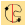
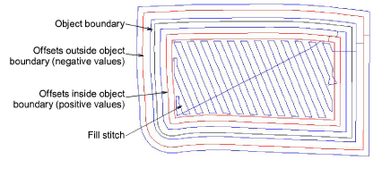

# Compound chenille settings

|            | Use Traditional Digitizing > Complex Fill to digitize filled shapes with a single stitch angle. Right-click for settings. |
| -------------------------------------------------------------- | ------------------------------------------------------------------------------------------------------------------------- |
|                          | Use Chenille > Moss to create a looped pile look.                                                                         |
|  | Use Chenille > Compound Chenille to automatically digitize chenille shapes with offset borders.                           |

Most chenille objects are digitized with Complex Fill in combination with Compound Chenille to create objects – even narrow ones – with built-in chain or moss borders. Some graphical tools can be used in combination with Compound Chenille, including Closed Shape, Rectangle, Ellipse, and Basic Shapes. Compound chenille objects must include a fill of Coil or Square stitching, usually with Moss stitch applying.

The Compound Chenille tool allows for up to three (1-3) offset borders, before and after. Borders can employ either moss or chain stitching, at specific offsets and needle heights.

## Related topics

- [Border settings](Border_settings)
- [Other settings](Other_settings)
