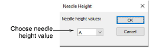

# Controlling needle heights

|  | Click Chenille > Needle Height to set needle height values. |
| -------------------------------------------- | ----------------------------------------------------------- |

Needle height controls the height of the loop formed by the chenille machine when it is sewing a moss stitch. The needle height setting has less effect on chain stitches though it does affect width. Normally, it’s best to use default settings. Do a test run on the machine to check the outcome. Then, if necessary, adjust needle heights.

If you intend to use loops of varying height, you can insert Needle Height functions and set their positions during digitizing. Even though stitch length affects loop height, it is easier and more accurate to adjust needle height. For safety, apply needle height values to each Moss block, even of the same height.

::: info Note
When you apply an explicit needle height to Compound Chenille objects, it only affects the fill, usually moss. It does not affect the values associated with included borders.
:::

## To adjust needle heights...

- Select the Moss object, including Compound Chenille, you want to adjust.
- Click the Needle Height icon. The dialog opens.

- Select a needle height value from the list and click OK. When stitching out, the chenille machine will automatically change needle height according to your selection.
- In the Stitch List, check that the setting has been applied.

::: tip
With some machines, needle height can optionally be adjusted on the machine. In practice, it is more common to adjust there rather than in the design. If so, clear the checkbox in the Machine Format Values dialog if you want to select needle heights manually on the machine.
:::

## Related topics

- [Chenille design parameters](../chenille_basics/Chenille_design_parameters)
- [Machine format settings](../chenille_output/Machine_format_settings)
- [Needle height default](../chenille_output/Needle_height_default)
