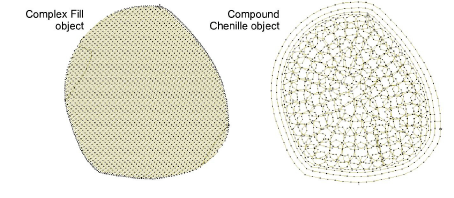
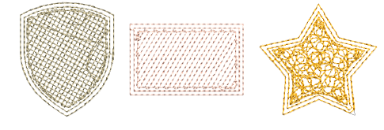

# Convert lockstitch to chenille

|                          | Use Chenille > Moss to create a looped pile look.                                                                                               |
| -------------------------------------------------------------- | ----------------------------------------------------------------------------------------------------------------------------------------------- |
|  | Use Chenille > Compound Chenille to automatically digitize chenille shapes with offset borders. Right-click to adjust automatic offset borders. |

You can convert complex fill and other closed objects to chenille using Compound Chenille. Multiple offset runs are generated automatically from the same boundary.

## To convert lockstitch to chenille...

1. Open a new design using the Chenille template and select a machine format to suit.

2. Select the complex fill or other closed object.

3. Select a chenille stitch type – usually Moss.

4. Select a chenille fill pattern – Square, Double Square or Island Coil. Once you have selected a pattern, the Compound Chenille icon becomes active.

5. Click the icon. Offset borders and a chenille fill are generated according to current settings.

Compound Chenille can be applied to many closed objects, including standard shapes.

6. With the object selected, open the Object Properties > Compound Chenille tab to adjust settings.

## Related topics

- [Start a new chenille design](../chenille_basics/Start_a_new_chenille_design)
- [Compound chenille settings](Compound_chenille_settings)
- [Controlling needle heights](Controlling_needle_heights)
- [Visualizing chenille stitching](../chenille_basics/Visualizing_chenille_stitching)
