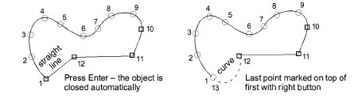
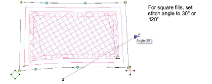
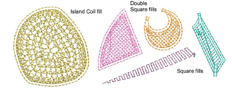

# Create compound chenille objects

|            | Use Traditional Digitizing > Complex Fill to digitize filled shapes with a single stitch angle. Right-click for settings. |
| ---------------------------------------------------- | ------------------------------------------------------------------------------------------------------------------------- |
|                          | Use Chenille > Moss to create a looped pile look.                                                                         |
|  | Use Chenille > Compound Chenille to automatically digitize chenille shapes with offset borders.                           |

Digitizing chenille objects involves the same techniques as regular lockstitch embroidery with the addition of chenille stitch types, Moss and Chain. For chenille work, you mainly use Complex Fill in combination with Compound Chenille to digitize objects – even narrow ones – mainly in combination with Moss stitching and built-in chain or moss borders.

## To digitize a compound chenille object...

1Open a new design using the Chenille template and select a machine format to suit.

2Select a closed shape input tool such as Complex Fill. Some graphic tools can be used in combination with Compound Chenille, such as Closed Shape, Rectangle, Ellipse, and Basic Shapes.

3Select Moss stitch and click the Compound Chenille icon. Chain has limited applicability to coil or double-square fill patterns.

4Select a fill pattern. Compound Chenille objects will only work with these:

| Fill pattern                                 | To fill...    |                                                    |
| -------------------------------------------- | ------------- | -------------------------------------------------- |
|              | Square        | Narrow shapes with single layer of straight lines. |
|  | Double Square | Larger shapes with two layers of straight lines.   |
|      | Island Coil   | Larger shapes with double-spiral stitches.         |

Tip: In theory, it makes little difference to the end result whether you use an underlying square or coil pattern. In practice, square patterns produce fills that vary in appearance with the direction of view. However, they are generally more suited to squarish shapes with sharp corners.

5Select a yarn color from the palette. Remember, the View by Chain/Moss function uses the first three colors in the palette. Color slots 1-3 are best left for display purposes only, where:

| Slot | Default | Element    |
| ---- | ------- | ---------- |
| 1    | Green   | Lockstitch |
| 2    | Blue    | Chain      |
| 3    | Red     | Moss       |

6Digitize the boundary like any embroidery object:

- Left-click for corner points
- Right-click for curve points.

Tip: Use the prompts in the Prompt Bar to help you digitize. If you make a mistake, press Backspace to delete the last reference point. Press Esc to undo all new reference points.

7Press Enter to complete.

8Mark entry and [exit points](../../glossary/glossary) on the boundary.

9Define stitch angle by digitizing two points.

Tip: While stitch angle has no effect on coil fill patterns, it can affect the appearance of square fill patterns. Best angles are 30° or 120°.

10Press Enter to complete. The Compound Chenille object is generated according to current settings.

11With the object selected, open the Object Properties > Compound Chenille tab to adjust settings.

Tip: The Compound Chenille tool in fact allows for up to three (1-3) offset borders, before and after. Borders can employ either moss or chain stitching, at specific offsets and needle heights. If you intend to use loops of different height, adjust needle height rather than the stitch length. This method is easier and more accurate.

## Related topics

- [Start a new chenille design](../chenille_basics/Start_a_new_chenille_design)
- [Digitizing with graphical tools](../../Digitizing/input/Digitizing_with_graphical_tools)
- [Creating free-form shapes](../../Digitizing/input/Creating_free-form_shapes)
- [Chenille design parameters](../chenille_basics/Chenille_design_parameters)
- [Compound chenille settings](Compound_chenille_settings)
- [Controlling needle heights](Controlling_needle_heights)
- [Visualizing chenille stitching](../chenille_basics/Visualizing_chenille_stitching)
