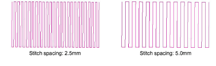

# Create narrow shapes of constant width

|      | Use Outline Stitch Types > Coil to Use to create borders or columns of even width for an open ‘coil’ effect. Right-click to adjust settings. |
| ------------------------------------------ | -------------------------------------------------------------------------------------------------------------------------------------------- |
|  | Use Outline Stitch Types > Square to create open borders or columns of even width for an open ‘toothed’ effect. Right-click for settings.    |
|            | Use Traditional Digitizing > Column C to digitize columns or borders of fixed width. Right-click for settings.                               |

To fill narrow shapes of constant width, use Coil or Square outlines with Moss stitching.

## To digitize coil shapes of fixed width...

- Select your preferred stitch pattern with Outline Stitch > Coil or Square.
- Select the preferred chenille stitch type:

| Chenille stitch                          | Uses  |                                                                                                                             |
| ---------------------------------------- | ----- | --------------------------------------------------------------------------------------------------------------------------- |
|    | Moss  | Create dense cover using looped stitch typical of chenille raised stitching. Can be used with Coil or Square fill patterns. |
|  | Chain | Create decorative stitching resembling links of a chain. Can be used with Square fill pattern.                              |

- Create a chenille object using Column C as your input method.

Tip: There is a limitation with Coil in handling sharp corners. Square patterns are generally better suited. The Smart Corners effect can be used with Column C objects.

- Press Enter to generate the shape.

- Juggle spacing settings in accordance with yarn thickness.

- Adjust coil spacing for looser or tighter looking chenille. Combine with width to achieve the desired chenille look.

- Stitch length determines the gap between needle points. For chain stitching, 2mm is standard. For moss stitching, it may be adjusted for yarn thickness.

Note: If you are using moss stitching, you need to create a border around the object. For this, you typically use the Run method with Chain stitching. If your machine supports it, you may also combine chenille with regular tie-off stitching.

## Related topics

- [Create columns & borders](../../Digitizing/input/Create_columns_borders)
- [Controlling corner stitching](../../Quality/quality/Controlling_corner_stitching)
- [Chenille design parameters](../chenille_basics/Chenille_design_parameters)
- [Chenille patterns](../../Decorative/specialty/Chenille_patterns)
- [Visualizing chenille stitching](../chenille_basics/Visualizing_chenille_stitching)
