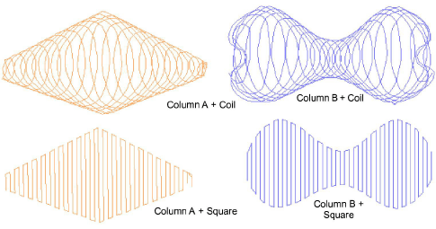
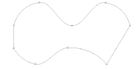
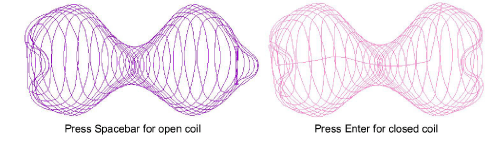

# Create narrow shapes of varying width

|                | Use Fill Stitch Types > Coil to stitch narrow shapes or columns where each stitch traverses the column width. Right-click to adjust settings.                  |
| ------------------------------------------ | -------------------------------------------------------------------------------------------------------------------------------------------------------------- |
|  | Use Fill Stitch Types > Square to create open straight parallel fills. Right-click for settings.                                                               |
|            | Use Traditional Digitizing > Column A to create columns of varying width and stitch angle. Right-click for settings.                                           |
|            | Use Traditional Digitizing > Column B to create asymmetrical columns of turning stitches, where opposite sides are different shapes. Right-click for settings. |

To fill narrow shapes of varying width, use Coil or Square fill with Moss stitching. Coil stitches are generated in spirals. Each stitch traverses the width of the column. With Square fill you can fill areas diagonally, or on the horizontal and vertical. Stitch length is consistent even over different widths. For more delicate work, use Square fill with Chain stitching.

## To digitize shapes of varying width...

1. Select your preferred stitch pattern with Fill Stitch > Coil or Square.

2. Select the preferred chenille stitch type:

| Chenille stitch                          | Uses  |                                                                                                                             |
| ---------------------------------------- | ----- | --------------------------------------------------------------------------------------------------------------------------- |
|    | Moss  | Create dense cover using looped stitch typical of chenille raised stitching. Can be used with Coil or Square fill patterns. |
|  | Chain | Create decorative stitching resembling links of a chain. Can be used with Square fill pattern.                              |

3. Create a chenille object using Column A or Column B as your input method.

::: tip
Use the prompts in the Prompt Bar to help you digitize. If you make a mistake, press Backspace to delete the last reference point. Press Esc to undo all new reference points.
:::

4. Press Spacebar or Enter to generate the shape.

- Use Spacebar to generate open-ended coil stitching. This is useful for joining objects.
- Use Enter to generate closed-ended coil stitching.

::: info Note
Because moss stitching tends to unravel, you need to create a border around the object. For this, you typically use the Run method with Chain stitching. If your machine supports it, you may also combine chenille with regular tie-off stitching.
:::

## Related topics

- [Digitize columns of varying width](../../Digitizing/input/Digitize_columns_of_varying_width)
- [Creating chenille borders](Creating_chenille_borders)
- [Chenille design parameters](../chenille_basics/Chenille_design_parameters)
- [Chenille patterns](../../Decorative/specialty/Chenille_patterns)
- [Visualizing chenille stitching](../chenille_basics/Visualizing_chenille_stitching)
