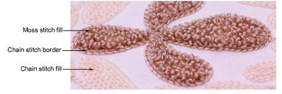
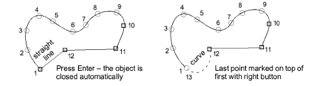
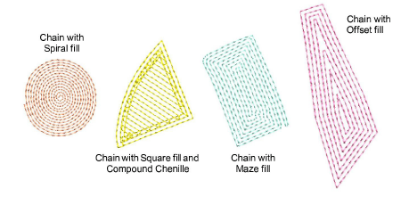

# Creating chain-stitch fills

|  | Use Traditional Digitizing > Complex Fill to digitize filled shapes with a single stitch angle. Right-click for settings.                                                |
| ---------------------------------------------------- | ------------------------------------------------------------------------------------------------------------------------------------------------------------------------ |
|                        | Use Chenille > Chain for decorative stitching resembling links of a chain. Can be used as a delicate fill or as a border for moss fills. Right-click to adjust settings. |

Because chain stitching forms flowing, curved lines, it is mainly used for outlines and more delicate work. It can, however, be used to create flatter fills. Because chenille yarn is thicker than normal thread, it is critical to avoid yarn pile-up caused by overlapping stitches, particularly chain stitches. For this reason, we recommend using open stitch patterns such as Maze Fill, Offset Fill, or Spiral Fill to create the kind of effect you see in this sample.

::: tip
With Chain stitch blocks, there is no need for borders as such. Chain itself provides a good border.
:::

## To digitize a chain-stitch fill...

1. Open a new design using the Chenille template and select a machine format to suit.

2. Choose an input method – graphical or traditional.

Since stitch angle has no relevance to chain stitching, Complex Fill is fine for most shapes. Some graphic tools may be used – Closed Shape, Rectangle, Ellipse, and Basic Shapes.

3. Select Chain stitch and choose a suitable fill pattern:

| Fill pattern                             | Uses        |                                                                          |
| ---------------------------------------- | ----------- | ------------------------------------------------------------------------ |
|      | Maze Fill   | Create maze-like stitching which follows object contours for open fills. |
|          | Offset Fill | Create offset fill stitching in any closed shape.                        |
|  | Spiral Fill | Create spiral stitching from the center of any closed object.            |

4. Right-click for settings and adjust spacing and length as necessary. Stitch length determines the size of chain. The greater the value, the larger the pattern. Spacing needs to accommodate yarn thickness.

5. Digitize the boundary like any embroidery object:

- Left-click for corner points
- Right-click for curve points.

::: tip
Use the prompts in the Prompt Bar to help you digitize. If you make a mistake, press Backspace to delete the last reference point. Press Esc to undo all new reference points.
:::

6. Press Enter to complete. The chain-fill object is generated according to current settings.

7. With the object selected, open Object Properties to adjust fill settings, including spacing.

## Related topics

- [Start a new chenille design](../chenille_basics/Start_a_new_chenille_design)
- [Chenille design parameters](../chenille_basics/Chenille_design_parameters)
- [Digitizing with graphical tools](../../Digitizing/input/Digitizing_with_graphical_tools)
- [Creating free-form shapes](../../Digitizing/input/Creating_free-form_shapes)
- [Maze fills](../../Decorative/specialty/Maze_fills)
- [Offset fills](../../Decorative/curves/Offset_fills)
- [Spiral fills](../../Decorative/curves/Spiral_fills)
- [Visualizing chenille stitching](../chenille_basics/Visualizing_chenille_stitching)
