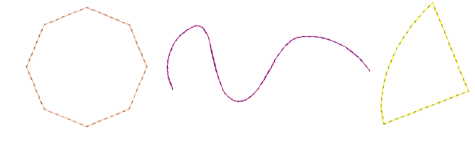

# Creating chenille borders

|        | Use Chenille > Chain for decorative stitching resembling links of a chain. Can be used as a delicate fill or as a border for moss fills. Right-click to adjust settings. |
| ---------------------------------------------- | ------------------------------------------------------------------------------------------------------------------------------------------------------------------------ |
|            | Use Traditional Digitizing > Digitize Run to create row of single stitches along a digitized line.                                                                       |
|        | Use Graphics Digitizing > Digitize Open Shape to digitize open shapes. Press &lt;Ctrl&gt; to constrain.                                                                        |
|  | Use Toolbox > Simple Offsets to create simple outlines for any filled embroidery or closed vector object.                                                                |

Chenille objects, particularly with moss stitching, need to have a border to contain stitches within the shape and provide edge definition. One or two offset run-arounds provide a clear edge and help to secure chenille fills. The Compound Chenille tool allows up to three (1-3) offset borders to be generated before and after the fill. Typically, a compound object will include moss fill with a chain run border before and after to tie it all together. You can, however, digitize single-line borders manually. For this, you often use the Run method with Chain stitching.

Tip: If your machine supports it, you may also combine chenille with regular tie-off stitching.

## To digitize a chenille border...

1Select Digitize Run input method. Chenille Run stitches are similar to lockstitch except that stitch length should be constant.

2Open Object Properties and turn off Variable run length.

3Set a suitable stitch length. This value determines the size of chain. The larger the value, the larger the pattern. It is a matter of experience and preference based on yarn thickness.

4Choose Chain stitch type for chenille runs and borders.

5Digitize the boundary like any embroidery object:

- Left-click for corner points
- Right-click for curve points.

Tip: Use the prompts in the Prompt Bar to help you digitize. If you make a mistake, press Backspace to delete the last reference point. Press Esc to undo all new reference points.

6Press Enter to complete.

Tip: Use Backtrack and Repeat to reinforce outlines while specifying the direction of stitching.

## Tips for use

- You may also create closed chenille borders with most of the graphical input methods in combination with Run outlines, including Basic Shapes.

- You can also generate chenille borders by duplicating or cloning objects and applying Run with, say, Chain stitch. Or use the Simple Offsets tool to quickly generate one or multiple borders.

- Remember too that you can create standalone chenille boundaries by turning off stitch fills in Compound Chenille objects.

## Related topics

- [Digitizing outlines & details](../../Digitizing/input/Digitizing_outlines_details)
- [Duplicate & clone objects](../../Modifying/combine/Duplicate_clone_objects)
- [Generating outlines & offsets](../../Modifying/productivity/Generating_outlines_offsets)
- [Reinforce outlines](../../Quality/quality/Reinforce_outlines)
- [Chenille design parameters](../chenille_basics/Chenille_design_parameters)
- [Visualizing chenille stitching](../chenille_basics/Visualizing_chenille_stitching)
