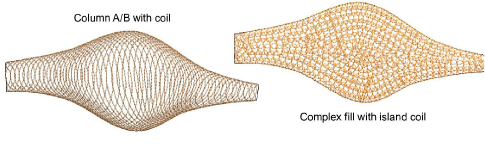

# Creating narrow chenille shapes

Complex Fill, and by extension Compound Chenille, cannot be used with Coil and will default instead to Island Coil. Variable-width Coil stitching can only be created with Column A or Column B input methods. Column C can be used to create columns of constant width. Square fill can also be used for narrow shapes. Moss stitching is usually applied to both fill types.

## Related topics

- [Create narrow shapes of varying width](Create_narrow_shapes_of_varying_width)
- [Create narrow shapes of constant width](Create_narrow_shapes_of_constant_width)
