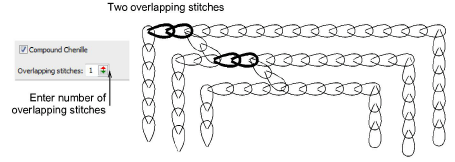
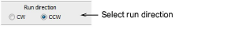
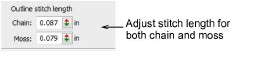
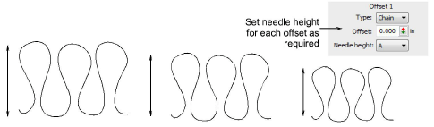
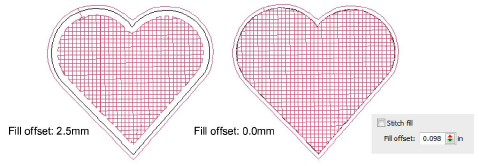
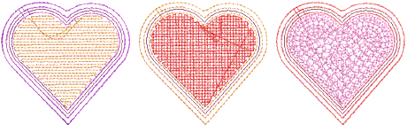
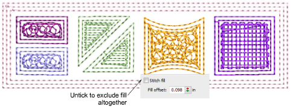

# Other settings

The Compound Chenille docker allows you to:

- Set the number of overlapping stitches between offset runs.
- Change run stitch direction, clockwise or anti-clockwise.
- Set offset stitch length – both chain and moss.
- Set offset needle height for machines which support it.
- Exclude stitch fill altogether.

## Overlapping stitches

The Overlapping Stitches setting allows you to set the number of overlapping stitches between offset runs. This shifts connectors between offset runs by a few stitches to prevent stitch buildup at the joins. Also, connectors are less visible if they are not in one line.

## Run stitch direction

You can set the run stitching direction for offset borders.

The correct direction is important for moss borders. When stitching out, the yarn should not loosen due to any counter-twisting effect. Instead, it should be more tightly twisted. When purchasing yarns, some embroiders check the twisting direction to make sure it is right for the machine.

## Offset stitch length

You can adjust stitch length for both chain and moss offsets.

Stitch length should be constant for the same thread type throughout a design. If stitch length varies, the height of moss loops and width of chain loops will also vary, causing uneven embroidery. The chenille machine pulls up the same length of yarn for each loop according to the current needle height setting.

## Offset needle height

Needle Height controls are available for each offset. If you intend to use loops of varying height, always adjust needle height rather than stitch length. Even though stitch length also affects the loop height, it is easier and more accurate to adjust needle height. Needle height has less effect on chain stitches although it does affect width. [See also Controlling needle heights.](Controlling_needle_heights)

## Fill offset

Optionally, enter a Fill Offset value. Fill Offset sets the gap between the digitized boundary and fill area. It is always measured from the object boundary, not from the last offset. Use a positive value to position the border within the boundary, a negative value to offset it outside the boundary.

::: tip
Color changes can be manually inserted between fill and offsets.
:::

## Borders without fills

The fill in a compound chenille object is included by default. However, you can choose to include or exclude it and just use offset borders. You might, for example, want to exclude the fill when creating a common chenille border around multiple chenille objects.

## Related topics

- [Create compound chenille objects](Create_compound_chenille_objects)
- [Chenille design parameters](../chenille_basics/Chenille_design_parameters)
- [Controlling needle heights](Controlling_needle_heights)
