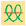
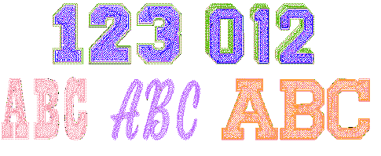
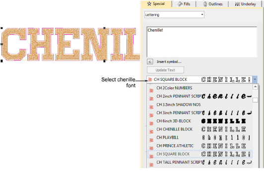
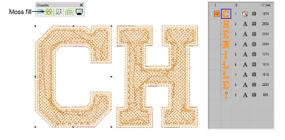
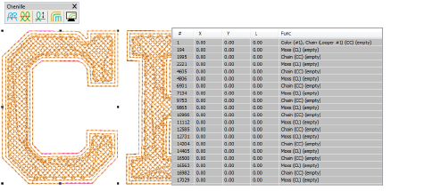

# Adding lettering to chenille designs

|  | Click Toolbox > Lettering to enter text on screen. Right-click to enter text in the docker and adjust settings for embroidery lettering. |
| -------------------------------------- | ---------------------------------------------------------------------------------------------------------------------------------------- |
|            | Use Chenille > Moss to create a looped pile look. Right-click to adjust settings.                                                        |

The Chenille add-on Element includes dedicated chenille fonts. These fonts can be scaled and colored like regular fonts. By their nature, however, chenille fonts are digitized for relatively large applications – anywhere between 2" (50mm) and 6" (150mm).

Add chenille lettering as you would regular lockstitch lettering. Select a chenille font via the Lettering docker. Chenille fonts are tagged with the prefix ‘CH’.

Chenille fonts can be used like regular fonts except that they must employ the ‘As Digitized’ joining method. Some are digitized with Coil fill, others with Double Square. If you break chenille lettering into its component letters, you will find each one is a compound chenille object with a single chain and two moss offsets before the moss fill.

If you check the Stitch List, you will see again that each letter is stitched with its own chain and moss stitching.

## Related topics

- [Creating Embroidery Lettering](../../Lettering/lettering_create/Creating_Embroidery_Lettering)
