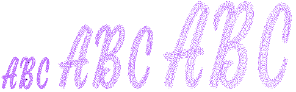

# Scaling chenille lettering

Some chenille fonts are made to suit a particular letter size and one type of thread (thickness) only. The size of these fonts cannot be successfully varied by more than 5-10% from that recommended. It is not recommended that you change the stitching values (stitch length, spacing, etc) of these fonts at all. Other chenille fonts have been designed for use within certain size ranges and of these some Double Square fonts allow object properties such as stitch length, spacing and offsets to be varied.

## Related topics

- [Modifying lettering](../../Lettering/lettering_edit/Modifying_lettering)
