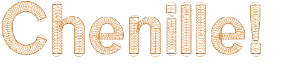
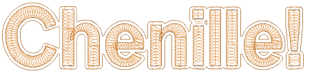
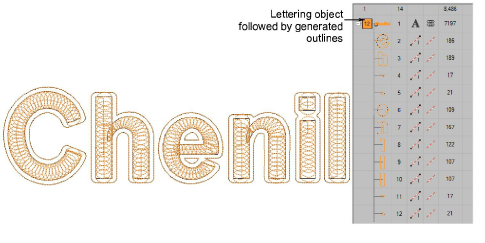
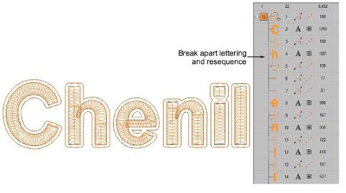
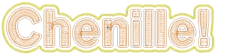

# Using other fonts with chenille

You can, with some effort, use standard embroidery fonts and even TrueType font for chenille lettering. Font letters are usually digitized with Column A so you cannot automatically add borders with Compound Chenille. You need to add a border either manually or by generating offsets. For instance, let’s say you want to create chenille lettering with a regular block font and coil fill. Each letter would quickly unravel without traditional chenille chain and moss outlines.

You could attempt to use the Simple Offsets to generate outlines and turn them into chain runs. However, as shown here, you are likely to end up with a single outline around the entire lettering object.

A solution can be found by increasing letter spacing before generating simple offsets. However, there is a problem in that the offsets are generated as separate objects following the lettering.

The lettering object must be broken apart and everything resequenced.

For additional embellishment, you could generate other offsets around the entire object – e.g. Column C with Coil and Moss.

