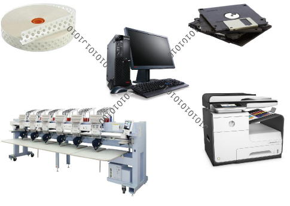

# Chenille Output

Different embroidery machines speak different languages. They have their own control commands for the various machine functions. Before you can stitch a design, it must be in a format which can be understood by the embroidery machine. When you select a machine format, EmbroideryStudio translates the functions that were applied during digitizing into machine functions that can be understood by the machine. Chenille stitch types – Moss and Chain – can only be used with a chenille machine format.

Chenille files open in EmbroideryStudio like any other EMB design. Similarly, you save chenille designs to native EMB format or export them as machine files. They can be output to embroidery floppy disk, punched to a paper tape or sent directly to embroidery machine connected to the computer. The same file can be used by combination machines for both Chenille and Lockstitch embroidery.

::: tip
From the same design file, you can also output a [production worksheet](../../glossary/glossary#production-worksheet) for the embroidery machine operator. [See Design Reports for details.](../../Production/reports/Design_Reports)
:::

## Related video

<iframe width="560" height="315" src="https://www.youtube.com/embed/VoPmf_xPMPo" title="YouTube video player" frameborder="0" allow="accelerometer; autoplay; clipboard-write; encrypted-media; gyroscope; picture-in-picture" allowfullscreen></iframe>

## Related topics

- [Chenille machine formats](Chenille_machine_formats)
- [Machine format settings](Machine_format_settings)
- [Chenille machine files](Chenille_machine_files)
- [Outputting chenille designs](Outputting_chenille_designs)
