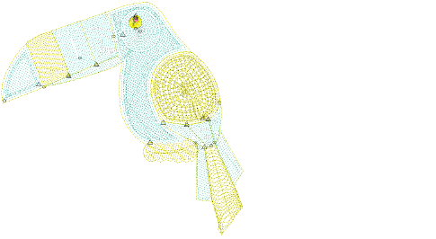

# Chenille machine files

Different embroidery machines understand different languages. Each has its own control commands. Before you can stitch out a design, it must be in a format which can be interpreted by the machine. Machine or ‘stitch’ designs are low-level formats for direct use by embroidery machines. They contain only stitch coordinates and machine functions. They are generally created on-the-fly when sending designs to machine. Or they are converted when saving to disk or memory stick.

Tip: There is no chenille-specific machine file format as such. However, if a design was created as a chenille design, you will need to select the associated machine format when you open the file in order to display it correctly.

## Related topics

- [Read chenille designs](Read_chenille_designs)
- [Chenille machine file encoding](Chenille_machine_file_encoding)
