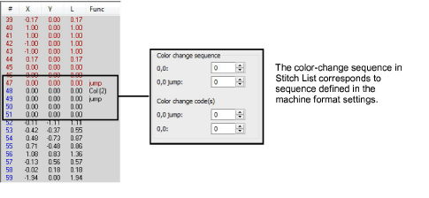

# Color-change sequence

Some machines cannot interpret Color Change commands unless they form part of a ‘color change sequence’ made up of Empty Jumps and Empty Stitches before and after each Color Change command. Check the requirements of your machine to determine whether you need to enter color change sequence values.

In the Advanced tab, the Color Change Sequence panel reads from top to bottom, in the order the codes appear in the sequence. The first two fields show the number of Empty Stitches and Empty Jumps to insert before the Color Change command. The other fields show the Empty Jumps and Empty Stitches to insert after the command.

## Related topics

- [Machine Formats](../../Setup/machines/Machine_Formats)
