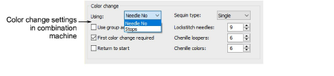

# Color-change values

Chenille machines interpret ‘Color Change’ functions in the design either as a Needle Number or Stop functions on the machine.

The following rules apply:

- Single-needle machines simply stop when a Color Change or Stop function is encountered.
- Some multi-needle machines default to the next color without stopping.
- Some multi-needle machines support direct needle addressing.

| Function      | Purpose                                                                                                                                                                                                                                       |
| ------------- | --------------------------------------------------------------------------------------------------------------------------------------------------------------------------------------------------------------------------------------------- |
| Stop          | Stop functions allow the operator to manually change threads. They are generally used with machines that only have one needle. Stop functions are sometimes combined with Jump functions to indicate color changes.                           |
| Color Change  | For those machines that support them, Color Change functions tell the machine to move to the next needle whenever a CC function is encountered. The machine must have the correct thread colors loaded according to the production worksheet. |
| Needle Number | For needle addressing machines, each color ‘slot’ on the color palette corresponds to a needle number. Needle Number functions are sometimes combined with Jump functions to indicate color changes.                                          |

## Needle addressing

For needle addressing machines, you need to specify how many needles or loopers are on the machine. Or both, in the case of combination machines. This tells the machine how often it needs to stop for the operator to change threads. For example, for a design with 15 colors to be stitched out on a machine with five needles, it must stop after every three color changes in order for the operator to change threads.

## Other settings

Other settings may include:

| Setting              | Purpose                                                                                                                                                                                                                                                                                                     |
| -------------------- | ----------------------------------------------------------------------------------------------------------------------------------------------------------------------------------------------------------------------------------------------------------------------------------------------------------- |
| Use group addressing | Some machines can group two heads together so you can stitch a design using needles from both heads. For example, if a machine has two heads and nine needles per head, the machine moves the hoop from the first head under the second head, which allows you to stitch 18 colors without a manual change. |
| First CC required    | Some machines require a First CC code to initialize the machine and bring the head back to the first color change needle position.                                                                                                                                                                          |
| Return to start      | This returns the needle to the start of design, preparing the machine for the repeat run.                                                                                                                                                                                                                   |

## Related topics

- [Machine Formats](../../Setup/machines/Machine_Formats)
