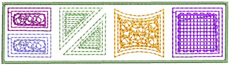
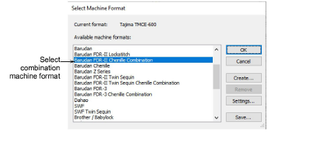

# Combined chenille & lockstitch

Chenille designs can be converted to any machine format, including lockstitch machines. This is useful when you wish to combine regular embroidery and chenille embroidery in a single design. Combined chenille and lockstitch design can be output to machine from a single file.

## To combine chenille and lockstitch...

- Plan your chenille and lockstitch design.
- Select a combination machine format via the Design menu.

- Design you design using a combination of chenille and lockstitch stitch types.
- When using a machine that supports both lockstitch and chenille, you can easily interchange lockstitch and chenille objects by selecting or deselecting chenille stitch types – Chain or Moss.
