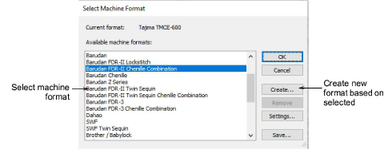
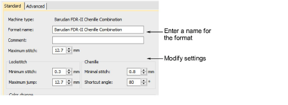
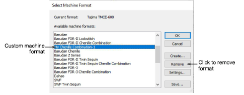

# Create custom formats

If you don’t want to overwrite standard machine formats, you can create a new format, based on an original, and make it available to all designs. Select Design > Select Machine Format and select a machine format on which to base the new format.

Click Create. The Machine Format Settings > Standard tab opens.

Enter a name for the new format. Overwrite the default – e.g. ‘Chenille Combination-1’. In the Comment field, enter any information that will help you identify the format – e.g. ‘No Trim’. Adjust machine format settings as required. The new format appears in the Available Machine Formats list.

::: info Note
You can’t remove standard formats but you can remove custom machine formats from your system when they are no longer required.
:::

## Related topics

- [Machine format settings](Machine_format_settings)
