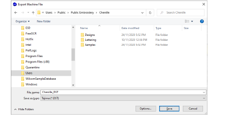
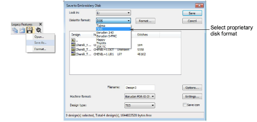

# Export chenille designs

|  | Use Legacy Features > Embroidery Disk to open designs from or save to proprietary embroidery disk formats. |
| ---------------------------------------------------------- | ---------------------------------------------------------------------------------------------------------- |

While chenille design files are saved to native EMB format, this cannot be read by machine. You can export designs to local disk, embroidery disk, or even punch them to paper tape.

## To export a chenille design...

- To export a chenille design as a machine file, select File > Export Machine File.

- To save a chenille design to a proprietary embroidery disk, choose Legacy Features > Embroidery Disk > Save As.

Tip: Once a design is complete, you can output to any supported embroidery machine without changing the original machine format. If a selected machine format does not support a particular function in the design – either automatically or manually inserted – it is simply ignored.

## Related topics

- [Chenille machine formats](Chenille_machine_formats)
- [Exporting designs for machine](../../Production/output/Exporting_designs_for_machine)
