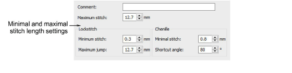

# Minimal & maximal stitch values

The chenille stitch length settings avoid small stitches during chenille stitch generation. This filter operates only on chenille stitch types and has no effect on lockstitch stitch types. That is, unless the format pertains to a combination machine. In that case, you can set values independently for lockstitch and chenille.

In the Minimal Stitch field, enter the smallest stitch to allow when outputting to the selected machine. The Maximum Stitch value depends on the tape code used by your machine:

| System  | Value   |
| ------- | ------- |
| Binary  | 12.7 mm |
| Ternary | 12.1 mm |

## Related topics

- [Machine Formats](../../Setup/machines/Machine_Formats)
