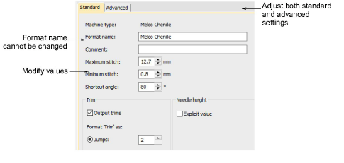

# Modify format for specific designs

Use this method if you intend to modify machine format values for a specific design without changing the original format. Select Design \> Machine Format Settings.

Adjust format settings as required. A new machine format is created for the particular design. It is automatically named after the original machine format together with the design name – e.g. Melco - Design1. This appears in the Select Machine Format dialog and is saved with the design.

## Related topics

- [Machine format settings](Machine_format_settings)
