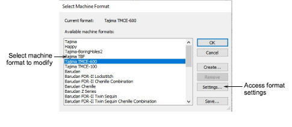
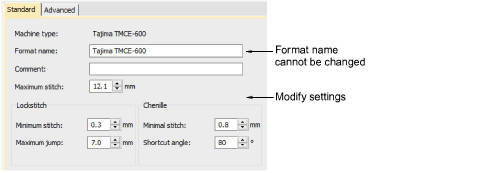

# Modify standard formats

If the standard machine values are incorrect for your particular machine, you can change them. From the Select Machine Format dialog, select a machine format to modify.

Click Settings to access the format settings. Adjust format settings as required. The new settings are saved with the selected format and are available to all new designs.

## Related topics

- [Machine format settings](Machine_format_settings)
