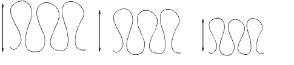
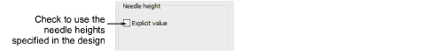

# Needle height default

On some chenille machines, needle height can be set to control the loop size formed when a machine sews moss stitch.

With some machines, needle height can also be adjusted on the machine. Thus you can choose whether to use heights specified in the design or not. Clear the checkbox if you want to select needle heights manually on the machine.

## Related topics

- [Machine Formats](../../Setup/machines/Machine_Formats)
