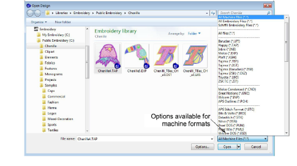
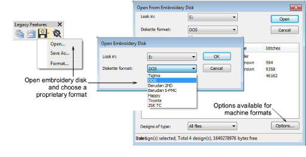
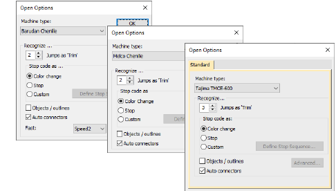

# Read chenille designs

|                      | Use Standard > Open to open an existing design.                                                            |
| ------------------------------------------------ | ---------------------------------------------------------------------------------------------------------- |
|  | Use Legacy Features > Embroidery Disk to open designs from or save to proprietary embroidery disk formats. |

When you read a chenille machine file, it is converted to EMB format. The chenille functions appear in the converted design in the same way as they are stored in the machine file or on paper tape. When reading a chenille design from stitch data – e.g. Melco EXP, Tajima or Barudan disk – Stitch Processor converts stitches to objects. However, it does not fully recognize Coil and Square stitching. These will be converted to a series of Run stitch objects. This limits the scalability of these designs to ±5-10%. However, old designs can be readily stitch-edited and sections re-digitized if required.

## To read a chenille design...

- Open a chenille design from DOS or embroidery disk as follows:
- To open a chenille machine file, choose a specific machine file format from the droplist or choose ‘All Machine Files’.

- If your chenille design is saved to proprietary disk, select Embroidery Disk from the Legacy Features toolbar and choose your format from the dialog.

- If you are opening a machine file, the Options button is activated. Chenille designs cannot be automatically distinguished from lockstitch designs. You need to tell the system which machine format you are using.

::: tip
In Tajima TMCE-600, all Chenille stops are interpreted as color changes.
:::

- Select a chenille machine from the Machine Type list and click OK.

## Related topics

- [Machine format settings](Machine_format_settings)
- [Read chenille designs](#XREF_23208_Opening_an)
- [Open machine files](../../Production/convert/Open_machine_files)
