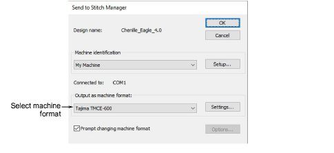

# Send chenille designs to machine

|  | Use Standard > Send to Connection Manager to connect to supported machines via proprietary machine software.                                   |
| ------------------------------------------------------------------ | ---------------------------------------------------------------------------------------------------------------------------------------------- |
|          | Use Legacy Features > Send to Stitch Manager to send a design to any supported embroidery machine without changing the original design format. |

Chenille designs can be sent directly to an embroidery machine if connected to the computer. Select the correct machine format before sending the design.

Newer machines use USB or Wired-Wireless network connections. EmbroideryStudio supports these connections via the Connection Manager. Older-style machines generally use serial port connections. EmbroideryStudio supports connection to these machines via the Stitch Manager.

## Related topics

- [Chenille machine formats](Chenille_machine_formats)
- [Machine format settings](Machine_format_settings)
- [Sending designs to machine](../../Production/output/Sending_designs_to_machine)
