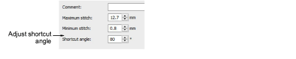

# Shortcut angle values

Some chenille machine types require that the angle between one stitch and the next is not very sharp – e.g. Tajima chenille machines require it to be at least 60°. The Chenille Shortcut Angle setting avoids sharp changes in stitch direction during chenille stitch generation.

This filter operates only on chenille stitch types and has no effect on lockstitch stitch types. Chenille automatically applies the shortcut angle to all cover stitches inside an object. However connections between travel stitches and offsets and fills are not always checked. Also, the shortcut is not applied to connecting stitches and jumps between objects.

## Design checker

A design checker is provided to identify chenille Shortcut Angle violations. The design checker is activated by hot key Ctrl+K. The stitch cursor will jump to the first stitch which violates the Shortcut Angle. You must correct this problem by stitch editing. Press the hot key combination again for the software to detect any problems further into the design.

::: info Note
Non-EMB embroidery format chenille designs can be shortcut-checked when opened into EmbroideryStudio by clearing the Outlines/Objects checkbox.
:::

## Related topics

- [Machine Formats](../../Setup/machines/Machine_Formats)
