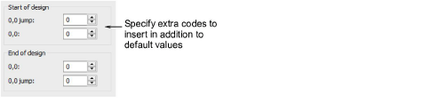

# Start/end of design sequence

In addition to any End of Design function, some machines require extra Empty Stitches and Empty Jumps in order to stitch the start and end of a design. Other machines require a Stop function. Depending on the machine type, you may also require commands to initialize the machine or trigger the frame out exit after stitching. Remember that these fields show the number of extra codes you want to insert in addition to the default values.

When starting with chain stitching, an empty stitch (non-data) code will automatically be inserted at the start of the design. When starting with moss stitching, an empty stitch (non-data) and a stop code will be automatically inserted at the start of the design.

Warning: Do not digitize two Empty Stitches at the beginning of the design, as this will affect registration. Avoid using Empty Stitches elsewhere in the design. Other Tajima chenille values are the same as the standard lockstitch Tajima machine values.

## Related topics

- [Machine Formats](../../Setup/machines/Machine_Formats)
