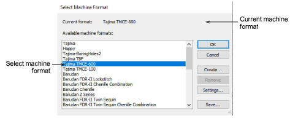

# Switch machine formats

Once a design is complete, you can output to any supported embroidery machine without changing the original machine format. Explicit support is provided for these machine types:

- Tajima TBF
- Tajima TMCE-100
- Tajima TMCE-600
- Barudan FDR-II Chenille Combination
- Barudan Chenille
- Barudan FDR-II Twin Sequin Chenille Combination
- Barudan FDR-3
- Barudan FDR-3 Chenille Combination
- Melco Chenille

If a selected machine format does not support a particular function in the design – either automatically or manually inserted – it is simply ignored.

## To switch machine formats...

- Select Design > Select Machine Format.

- Select the required chenille machine format from the list.
- To check the settings for the selected format, click Settings.
- Click OK.
