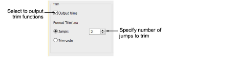

# Trim functions

Trim functions in chenille are basically the same as lockstitch. The difference is the absence of tie-ins and tie-offs due to mechanical limitation of the chenille head. With some machine formats you can specify how to format and interpret trim commands. Some machines understand specific trim codes. Other machines interpret multiple jumps as a trim command.

Machines without an automatic trimmer may not know how to interpret trim commands, and may even shift the design when a trim code is encountered. For these machines you need to deselect the Output trims checkbox so that trim functions are ignored when the design is stitched.

::: info Note
If you deselect the Output Trims checkbox, the trim functions are not removed from the design but simply ignored for the selected machine format.
:::

## Related topics

- [Machine Formats](../../Setup/machines/Machine_Formats)
