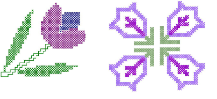

# Cross Stitch Embroidery

Cross stitching is a popular technique for filling large areas with low stitch counts. It can also be used for outlines and borders. It is suitable for homeware, tablecloths, children’s clothes and folk designs. Cross stitch is also sometimes combined with appliqué.

ES Cross Stitch is an add-on cost option for most levels of EmbroideryStudio. You must have the cross stitch option activated in your software to use cross stitch.

## Cross stitch essentials

This section describes the use of the ES Cross Stitch design window, as well as techniques for setting up your work environment and design size and density. It also covers working with backdrops and viewing cross stitch designs. It also discusses handling of cross stitch design files. [See Cross Stitch Essentials for details.](../cross-stitch_essentials/Cross_Stitch_Essentials)

## Cross stitch digitizing

This section describes techniques for manual cross stitch digitizing. It also covers automatic techniques and cross stitch lettering. [See Cross Stitch Digitizing for details.](../cross-stitch_digitizing/Cross_Stitch_Digitizing)

## Cross stitch editing

This section provides details of cross stitch editing features including selecting and locking stitches as well as simple stitch editing. It also covers transforming stitch blocks. It also deals with special editing techniques as well as adjusting thread colors. [See Cross Stitch Editing for details.](../cross-stitch_editing/Cross_Stitch_Editing)
