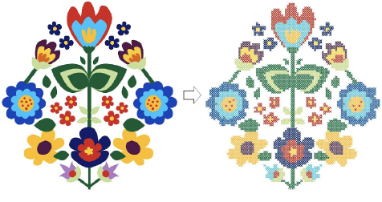

# Cross Stitch Digitizing

In ES Cross Stitch you can add cross stitches either to an entire design or selected areas. Or you can place them individually. There are two stitch types, outline and fill. An outline stitch can be a single run, or a line of cross stitches. A fill can be any of the cross stitch types. You can pre-set stitch type, length and the number of times each stitch is sewn.

This section describes techniques for manual cross stitch digitizing. It also covers automatic techniques and cross stitch lettering.

## Related topics

- [Digitizing with cross stitches](Digitizing_with_cross_stitches)
- [Digitizing backdrops automatically](Digitizing_backdrops_automatically)
- [Digitizing cross stitch letters](Digitizing_cross_stitch_letters)
