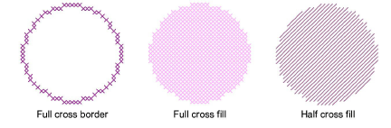

# Digitize circles

|  | Use Input > Circle to draw and digitize ovals or circles. |
| -------------------------------- | --------------------------------------------------------- |

The Circle tool provides a quick way to digitize filled or unfilled circles.

## To digitize a circle...

1. Click the Circle icon.

2. Select a color from the color palette.

3. Select an Outline or Fill stitch type.

4. Mark the center point then mark a point on the circumference.

- If you want a perfect circle, press Enter.
- If you want an ellipse, mark a third reference point.

The circle or oval is filled or outlined depending on the stitch type selected.

## Related topics

- [Set stitch color & type](Set_stitch_color_type)
