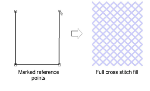
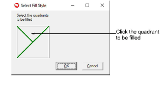
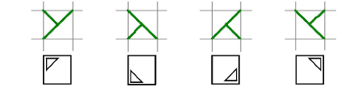
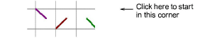
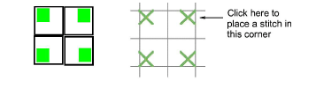
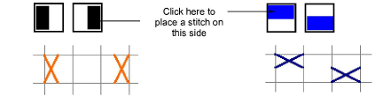
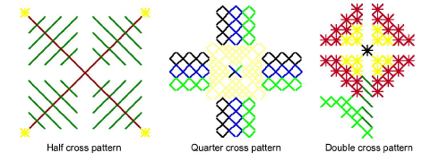

# Digitize cross stitch fills

|  | Use Input > Cross Stitch Fill to draw and digitize closed shapes. |
| -------------------------------------------------- | ----------------------------------------------------------------- |

You can create free-form filled shapes using the Cross Stitch Fill tool. Fill stitches are all cross stitches. A variety of fill stitch types is available from the Stitch toolbar. You can control the orientation of fractional cross stitches to create different patterning effects.

## To digitize a cross stitch fill...

1Click the Cross Stitch Fill icon.

2Select a color from the palette and cross stitch type from the Stitch toolbar. [See Set stitch color & type for details.](Set_stitch_color_type)

3Mark reference points on your design. Left-click for sharp corners and right-click for round corners.

4Press Enter. Depending on the stitch type selected, you will be prompted to set cross stitch orientation via the Select Fill Style dialog.

5To set cross stitch orientation, click the quadrant to be filled.

- To create three-quarter cross stitches, click the corner where you want the quarter stitch to be.

- To create half cross stitches, click the corner where you want your stitch to start.

- To create quarter cross stitches, click the corner where you want your stitch to start.

- To create mini cross stitches, click the corner where you want to place the stitch.

- To create vertical elongated cross stitches, click the side where you want to place the stitch.

6Click OK. The shape is filled with the selected stitch type.

## Related topics

- [Set stitch color & type](Set_stitch_color_type)
