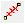
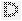
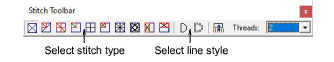
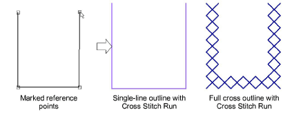
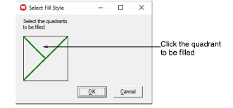

# Digitize cross stitch outlines

|        | Use Input > Cross Stitch Run to draw and digitize open shapes. |
| ------------------------------------------------------ | -------------------------------------------------------------- |
|  | Select Stitch > Single Line for a single line.                 |
|    | Select Stitch > Full Cross for lines of crosses.               |

You can create free-form outlines and borders using the Cross Stitch Run tool. There are two types of line stitch, Single Line and Full Cross, both available from the Stitch toolbar.

## To digitize cross stitch outlines...

1Click the Cross Stitch Fill or Cross Stitch Run icon.

2Select a color from the color palette.

3Click the Single Line or Full Cross icon. If you are using Full Cross, the currently selected cross stitch type applies.

Tip: The stitch palette can be dragged and floated anywhere within the Design Window.

4Mark reference points on your design. Left-click for sharp corners and right-click for round corners.

5Press Enter. The shape is filled or outlined depending on the stitch type selected. If you are using Full Cross, the currently selected cross stitch type applies.

Note: Depending on the stitch type you select, you can also set the stitch direction.

## Related topics

- [Set stitch color & type](Set_stitch_color_type)
