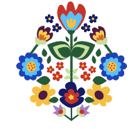
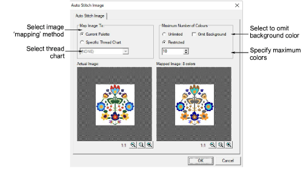
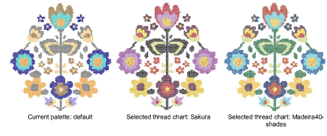
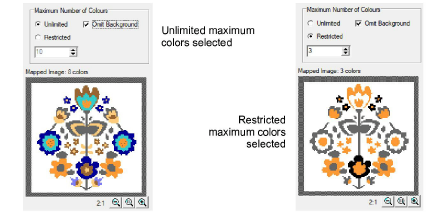
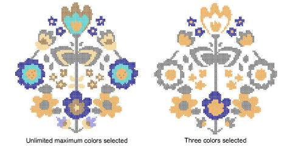

# Digitize images automatically

|  | Use Cross Stitch > Auto Stitch Image to automatically create cross stitch designs from pictures. |
| ------------------------------------------------------ | ------------------------------------------------------------------------------------------------ |

Digitize the entire backdrop image automatically using Auto Stitch Image. You can change the stitch type manually later as required.

## To digitize images automatically...

1. Prepare your image as necessary. Use a third party paint program to clean up the image.

2. Insert the image using Insert > Drawing File.

3. Click the Auto Stitch Image icon and click the image. The Auto Stitch Image dialog opens.

4. Select to map the picture colors to:

- Current Palette: only colors in the current palette are used.
- Specific Thread Chart: only colors in a selected thread chart are used.

5. Specify the maximum number of colors to be used:

| Option          | Purpose                                                                                                        |
| --------------- | -------------------------------------------------------------------------------------------------------------- |
| Unlimited       | Thread colors will be allocated according to the number of colors in the palette selected in the first dialog. |
| Restricted      | Enter the number of colors you want to use.                                                                    |
| Omit background | select to omit the background color.                                                                           |

The results display in the preview pane.

6. Click OK.

The image is digitized. You may need to touch up some areas manually.

::: info Note
Auto Stitch Image is disabled if no image is loaded.
:::

## Related topics

- [Working with backdrops](../cross-stitch_essentials/Working_with_backdrops)
