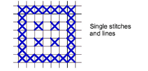

# Digitize single stitches or lines

|                                  | Use Cross Stitch > Pencil to draw a single stitch or line of stitches. |
| ---------------------------------------------------------------- | ---------------------------------------------------------------------- |
|  | Select Stitch > Single Line for a single line.                         |
|    | Select Stitch > Full Cross for lines of crosses.                       |

As an alternative to Cross Stitch Run, you can digitize a single stitch or line of stitches with the Pencil tool. Depending on the stitch type you select, you can also set the stitch direction.

## To digitize a single stitch or line...

1. Click the Single Line or Full Cross icon. If you are using Full Cross, the currently selected cross stitch type applies.

2. Select a color from the color palette.

3. Click the Pencil icon.

4. Click a square to make a single stitch, or click and drag the pencil to make a line. Press Ctrl and drag to draw straight vertical lines.

::: tip
You can also use the Pencil tool to create combinations of partial crosses comprised of multiple colors.
:::

## Related topics

- [Set stitch color & type](Set_stitch_color_type)
- [Create combination stitches](../cross-stitch_editing/Create_combination_stitches)
