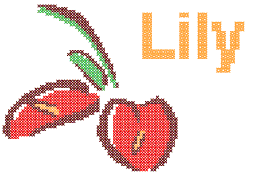
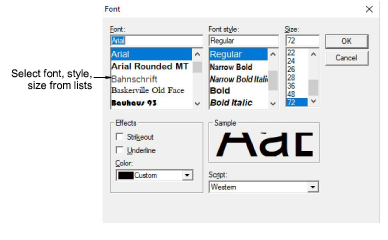
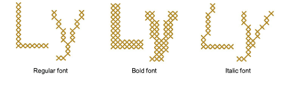
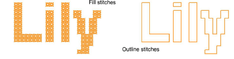
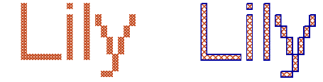

# Digitizing cross stitch letters

|  | Use Input > Lettering to add letters to your design. Right-click Lettering to open the Font dialog. |
| -------------------------------------- | --------------------------------------------------------------------------------------------------- |

As with EmbroideryStudio, ES Cross Stitch lets you add lettering to a design by typing it directly in the Design Window. Use the Font dialog to select font, size and style. Select either outline or fill to digitize letters. Once typed, you cannot edit letters. Each letter is treated as a stitch block.

Tip: Lettering in ES Cross Stitch may appear thicker than the original TrueType font. This is generally due to ‘ClearType’ font smoothing which is turned on by default in Windows Vista or later. Temporarily turning off ClearType produces better lettering in ES Cross Stitch although this may affect its appearance in other applications.

## To digitize cross stitch letters...

1Right-click Lettering. The Font dialog opens.

2Select a font type, style and size and click OK.

3Select a fill or outline stitch type from the Stitch toolbar.

4Click a start point in the Design Window, type the letters and press Enter.

Tip: To edit letters, use the Select tool with the Ctrl key to select, then change the stitch type or color as required.

## Related topics

- [Working with backdrops](../cross-stitch_essentials/Working_with_backdrops)
