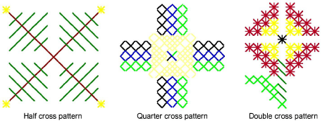

# Digitizing with cross stitches

ES Cross Stitch provides the full range of cross stitch types which you can use to create outlines and fills of any color. You can also control the orientation of fractional cross stitches to create different patterning effects. You can also adjust the density of individual cross stitches by stitching them once, twice or three times.

ES Cross Stitch provides techniques for digitizing single stitches or lines of stitches, filled and unfilled rectangles or circles, or filled and unfilled ‘closed’ free-form shapes. You can also create free-form outlines or borders.

## Related topics

- [Set stitch color & type](Set_stitch_color_type)
- [Set stitch density](Set_stitch_density)
- [Digitize cross stitch fills](Digitize_cross_stitch_fills)
- [Digitize cross stitch outlines](Digitize_cross_stitch_outlines)
- [Digitize single stitches or lines](Digitize_single_stitches_or_lines)
- [Digitize circles](Digitize_circles)
