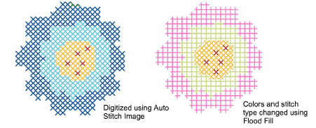

# Flood-fill color blocks

|  | Use Cross Stitch > Flood Fill to fill a closed shape or color block with stitches. |
| -------------------------------------- | ---------------------------------------------------------------------------------- |

Fill closed areas with stitches using the Flood Fill tool. You can also use the tool to change the color and stitch type of Full Cross outlines. This tool is ideally suited to editing stitch blocks in auto-digitized artwork but can be used with any cross stitch design.

::: info Note
The Flood Fill tool only works with cross stitches. Flood Fill will not work with bitmap images used as backdrops.
:::

## To flood-fill color blocks...

1. Select a color from the color palette.

2. Select a Fill stitch type.

3. Click the Flood Fill icon.

4. Click within a closed area. The stitch block is converted to the selected stitch type and color.

Warning: Flood Fill will not work within single line outlines. Some shapes with angled sides may not fill correctly.

## Related topics

- [Set stitch color & type](Set_stitch_color_type)
- [Working with backdrops](../cross-stitch_essentials/Working_with_backdrops)
