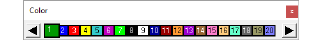
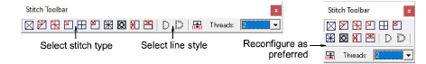
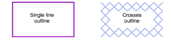

# Set stitch color & type

You can select stitch colors from the Color Palette before digitizing, or apply a new color to selected areas. Similarly, if you are creating a cross stitch fill or border, you can preset the cross stitch type from the Stitch toolbar.

## To select a stitch color and type...

- Select a color from the color palette to apply to newly digitized areas.

Tip: The color palette can be dragged and floated anywhere within the Design Window.

- To change colors, select a stitch block by dragging a marquee around it. Then select a new color.
- If you are creating a cross stitch fill or border, select a cross stitch type from the Stitch toolbar.

Tip: The stitch palette can be dragged and floated anywhere within the Design Window.

- If you are creating a cross stitch outline, click the Single Line or Full Cross icon. If you are using Full Cross, the currently selected cross stitch type applies.

