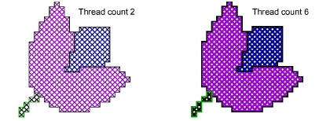

# Set stitch density

|  | Use the Stitch > Threads list to set stitch density. |
| -------------------------------------------------------- | ---------------------------------------------------- |

A common problem with cross stitch designs is that they ‘pull’, especially with smaller, closely packed stitches. Cross stitch designs tend to pull in a uniform way with gaps usually forming in straight lines. Sometimes holes appear giving the impression of missing stitches. To mitigate these problems, you can adjust cross stitch density by stitching once, twice or three times. The number of ‘crossovers’ correspond to the values 2, 4 and 6 in the Threads list. You can change these values at any time.

## To set stitch density...

- Select a value from the dropdown Threads list. The value 2 corresponds to a single stitch, 4 is double, while 6 is triple. This is represented on screen by line thickness.

::: tip
When you move your mouse over the stitch, a tool tip will tell you the type and color of stitch used.
:::
